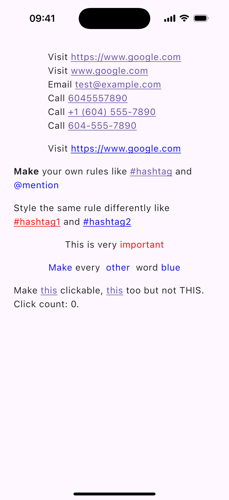
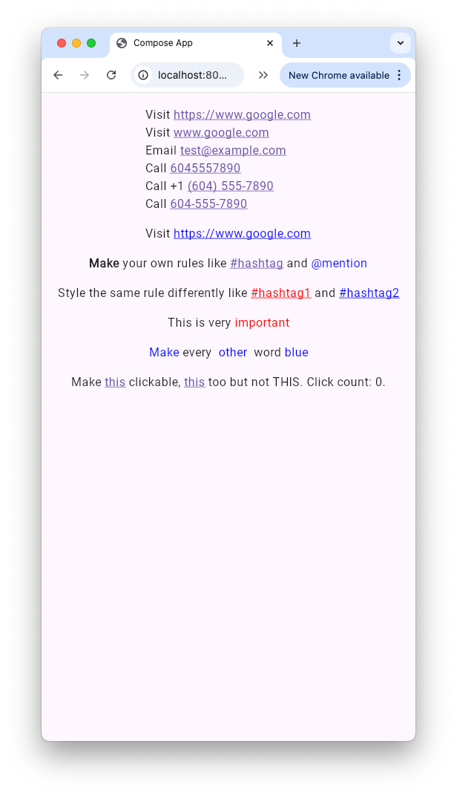

# AutoLinkText

AutoLinkText is a simple library that makes links, emails, and phone numbers clickable in text in Jetpack Compose and Kotlin Compose Multiplatform.

The latest demo app APK can be found in the [releases](https://github.com/Calvin-LL/AutoLinkText/releases) section under the "Assets" section of the latest release.

## Motivation

[`TextView`](https://developer.android.com/reference/android/widget/TextView) has [`autoLink`](https://developer.android.com/reference/android/widget/TextView#attr_android:autoLink) and [`Linkify`](https://developer.android.com/reference/android/text/util/Linkify) but Compose doesn't have an equivalent. This library aims to fill that gap.

| Android                                                                                                                                                                                         | iOS                                                                                                                                                                                 |
| ----------------------------------------------------------------------------------------------------------------------------------------------------------------------------------------------- | ----------------------------------------------------------------------------------------------------------------------------------------------------------------------------------- |
| <picture><source media="(prefers-color-scheme: dark)" srcset="assets/android-dark.png"></picture> | <picture><source media="(prefers-color-scheme: dark)" srcset="assets/ios-dark.png"></picture> |

| Desktop                                                                                                                                                                                         | Web                                                                                                                                                                                 |
| ----------------------------------------------------------------------------------------------------------------------------------------------------------------------------------------------- | ----------------------------------------------------------------------------------------------------------------------------------------------------------------------------------- |
| <picture><source media="(prefers-color-scheme: dark)" srcset="assets/desktop-dark.png"></picture> | <picture><source media="(prefers-color-scheme: dark)" srcset="assets/web-dark.png"></picture> |

## Features

- Make links, emails, and phone numbers clickable in your text out of the box
- Create custom matchers for your own patterns (e.g. hashtags, mentions, etc.)
- Customizable styling for links
- Customizable click listeners for links
- Supports Compose Multiplatform (Android, iOS, Desktop/JVM, Wasm, JS)

## Usage

### Version Catalog

If you're using Version Catalog, add the following to your `libs.versions.toml` file:

```toml
[versions]
#...
autolinktext = "2.0.1"

[libraries]
#...
autolinktext = { module = "sh.calvin.autolinktext:autolinktext", version.ref = "autolinktext" }
```

or

```toml
[libraries]
#...
autolinktext = { module = "sh.calvin.autolinktext:autolinktext", version = "2.0.1" }
```

then

```
dependencies {
    // ...
    implementation(libs.autolinktext)
}
```

### Gradle

If you're using Gradle instead, add the following to your `build.gradle` file:

#### Kotlin DSL

```kotlin
dependencies {
    // ...
    implementation("sh.calvin.autolinktext:autolinktext:2.0.1")
}
```

#### Groovy DSL

```groovy
dependencies {
    // ...
    implementation 'sh.calvin.autolinktext:autolinktext:2.0.1'
}
```

### Examples

See [demo app code](demoApp/composeApp/src/commonMain/kotlin/sh/calvin/autolinktext/demo/App.kt) for more examples.

#### Basic Usage

<picture><source media="(prefers-color-scheme: dark)" srcset="assets/basic-dark.png"></picture>

By default `AutoLinkText` turns URLs, emails, and phone numbers into clickable links, set the color to `MaterialTheme.colorScheme.primary`, and underline the links.

```kotlin
Text(
    AnnotatedString.rememberAutoLinkText(
        """
        |Visit https://www.google.com
        |Visit www.google.com
        |Email test@example.com
        |Call 6045557890
        |Call +1 (604) 555-7890
        |Call 604-555-7890
        """.trimMargin()
    )
)
```

#### Customize Link Color

<picture><source media="(prefers-color-scheme: dark)" srcset="assets/custom-color-dark.png"></picture>

You can override the default styling by providing a `TextLinkStyles` object.

```kotlin
Text(
    AnnotatedString.rememberAutoLinkText(
        "...",
        defaultLinkStyles = TextLinkStyles(
            SpanStyle(
                color = Color.Blue,
                textDecoration = TextDecoration.Underline
            )
        )
    )
)
```

#### Make Your Own Rules

<picture><source media="(prefers-color-scheme: dark)" srcset="assets/make-rule-dark.png"></picture>

There are 3 types of `TextRule`s: `Url`, `Clickable`, and `Styleable`.

- `Url` turns matched text into a clickable link, and when clicked, opens the URL.
- `Clickable` turns matched text into a clickable link, and when clicked, calls the `onClick` lambda.
- `Styleable` applies a `SpanStyle` to the matched text.

```kotlin
Text(
    AnnotatedString.rememberAutoLinkText(
        "Make your own rules like #hashtag and @mention",
        textRules = listOf(
            TextRule.Styleable(
                textMatcher = TextMatcher.StringMatcher("Make"),
                style = SpanStyle(fontWeight = FontWeight.Bold)
            ),
            TextRule.Clickable(
                textMatcher = TextMatcher.RegexMatcher(Regex("#\\w+")),
                onClick = {
                    println("Hashtag ${it.matchedText} clicked")
                },
            ),
            TextRule.Url(
                textMatcher = TextMatcher.RegexMatcher(Regex("@\\w+")),
                styles = TextLinkStyles(
                    SpanStyle(
                        color = Color.Blue
                    )
                ),
                urlProvider = { "https://twitter.com/${it.matchedText}" }
            )
        )
    )
)
```

#### Different Styles for Different Matches

<picture><source media="(prefers-color-scheme: dark)" srcset="assets/different-style-dark.png"></picture>

Provide a `stylesProvider` lambda that returns a `TextLinkStyles` object based on the matched text.

```kotlin
Text(
    AnnotatedString.rememberAutoLinkText(
        "Style the same rule differently like #hashtag1 and #hashtag2",
        textRules = listOf(
            TextRule.Clickable(
                textMatcher = TextMatcher.RegexMatcher(Regex("#\\w+")),
                stylesProvider = {
                    val hashtag = it.matchedText
                    if (hashtag == "#hashtag1") {
                        TextLinkStyles(
                            SpanStyle(
                                color = Color.Red,
                                textDecoration = TextDecoration.Underline
                            )
                        )
                    } else {
                        TextLinkStyles(
                            SpanStyle(
                                color = Color.Blue,
                                textDecoration = TextDecoration.Underline
                            )
                        )
                    }
                },
                onClick = {
                    println("Hashtag ${it.matchedText} clicked")
                },
            ),
        )
    )
)
```

#### `TextRule`s don't have to be clickable

<picture><source media="(prefers-color-scheme: dark)" srcset="assets/not-clickable-dark.png"></picture>

You can create `TextRule`s that are not clickable by using `TextRule.Styleable`.

```kotlin
Text(
    AnnotatedString.rememberAutoLinkText(
        "This is very important",
        textRules = listOf(
            TextRule.Styleable(
                textMatcher = TextMatcher.StringMatcher("important"),
                style = SpanStyle(color = Color.Red),
            )
        ),
    )
)
```

#### Make Your Own Matcher

<picture><source media="(prefers-color-scheme: dark)" srcset="assets/make-matcher-dark.png"></picture>

Create your own matchers with `TextMatcher.FunctionMatcher` that takes the given text and returns a list of `SimpleTextMatchResult`s.

```kotlin
Text(
    AnnotatedString.rememberAutoLinkText(
        "Make every  other  word blue",
        textRules = listOf(
            TextRule.Styleable(
                textMatcher = TextMatcher.FunctionMatcher {
                    val matches = mutableListOf<SimpleTextMatchResult<Nothing?>>()
                    var currentWordStart = 0
                    "$it ".forEachIndexed { index, char ->
                        if (char.isWhitespace()) {
                            val match = SimpleTextMatchResult(
                                start = currentWordStart,
                                end = index,
                            )
                            if (it.slice(match).isNotBlank()) {
                                matches.add(match)
                            }
                            currentWordStart = index + 1
                        }
                    }
                    matches.filterIndexed { index, _ -> index % 2 == 0 }
                },
                style = SpanStyle(color = Color.Blue),
            ),
        ),
    )
)
```

## API

- [AutoLinkText](autolinktext/src/commonMain/kotlin/sh/calvin/autolinktext/AutoLinkText.kt)
- [TextRule](autolinktext/src/commonMain/kotlin/sh/calvin/autolinktext/TextRule.kt)
  - [Url](autolinktext/src/commonMain/kotlin/sh/calvin/autolinktext/TextRule.kt)
  - [Clickable](autolinktext/src/commonMain/kotlin/sh/calvin/autolinktext/TextRule.kt)
  - [Styleable](autolinktext/src/commonMain/kotlin/sh/calvin/autolinktext/TextRule.kt)
- [TextRuleDefaults](autolinktext/src/commonMain/kotlin/sh/calvin/autolinktext/TextRule.kt)
  - [webUrl](autolinktext/src/commonMain/kotlin/sh/calvin/autolinktext/TextRule.kt)
  - [emailAddress](autolinktext/src/commonMain/kotlin/sh/calvin/autolinktext/TextRule.kt)
  - [phoneNumber](autolinktext/src/commonMain/kotlin/sh/calvin/autolinktext/TextRule.kt)
  - [defaultList](autolinktext/src/commonMain/kotlin/sh/calvin/autolinktext/TextRule.kt)
- [TextMatcher](autolinktext/src/commonMain/kotlin/sh/calvin/autolinktext/TextMatcher.kt)
  - [RegexMatcher](autolinktext/src/commonMain/kotlin/sh/calvin/autolinktext/TextMatcher.kt)
  - [StringMatcher](autolinktext/src/commonMain/kotlin/sh/calvin/autolinktext/TextMatcher.kt)
  - [FunctionMatcher](autolinktext/src/commonMain/kotlin/sh/calvin/autolinktext/TextMatcher.kt)
- [TextMatcherDefaults](autolinktext/src/commonMain/kotlin/sh/calvin/autolinktext/TextMatcher.kt)
  - [webUrl](autolinktext/src/commonMain/kotlin/sh/calvin/autolinktext/TextMatcher.kt)
  - [emailAddress](autolinktext/src/commonMain/kotlin/sh/calvin/autolinktext/TextMatcher.kt)
  - [phoneNumber](autolinktext/src/commonMain/kotlin/sh/calvin/autolinktext/TextMatcher.kt)
- [MatchFilter](autolinktext/src/commonMain/kotlin/sh/calvin/autolinktext/MatchFilter.kt)
- [MatchFilterDefaults](autolinktext/src/commonMain/kotlin/sh/calvin/autolinktext/MatchFilter.kt)
  - [NoOp](autolinktext/src/commonMain/kotlin/sh/calvin/autolinktext/MatchFilter.kt)
  - [WebUrls](autolinktext/src/commonMain/kotlin/sh/calvin/autolinktext/MatchFilter.kt)
  - [PhoneNumber](autolinktext/src/commonMain/kotlin/sh/calvin/autolinktext/MatchFilter.kt)
- [MatchStylesProvider](autolinktext/src/commonMain/kotlin/sh/calvin/autolinktext/MatchStylesProvider.kt)
- [SimpleTextMatchResult](autolinktext/src/commonMain/kotlin/sh/calvin/autolinktext/SimpleTextMatchResult.kt)
- [TextMatchResult](autolinktext/src/commonMain/kotlin/sh/calvin/autolinktext/TextMatchResult.kt)
- [MatchClickHandlerDefaults](autolinktext/src/commonMain/kotlin/sh/calvin/autolinktext/MatchClickHandler.kt)
  - [webUrl](autolinktext/src/commonMain/kotlin/sh/calvin/autolinktext/MatchClickHandler.kt)
  - [emailAddress](autolinktext/src/commonMain/kotlin/sh/calvin/autolinktext/MatchClickHandler.kt)
  - [phoneNumber](autolinktext/src/commonMain/kotlin/sh/calvin/autolinktext/MatchClickHandler.kt)

## Running the demo app

To run the Android demo app, open the project in Android Studio and run the app.

To run the iOS demo app, open the iosApp project in Xcode and run the app or add the following Configuration to the Android Studio project, you may need to install the [Kotlin Multiplatform Mobile plugin](https://plugins.jetbrains.com/plugin/14936-kotlin-multiplatform-mobile) first.


To run the web demo app, run `./gradlew :composeApp:wasmJsBrowserDevelopmentRun`.

To run the desktop demo app, run `./gradlew :demoApp:ComposeApp:run`.

## Contributing

Open this project with Android Studio Preview.

You'll want to install the [Kotlin Multiplatform Mobile plugin](https://plugins.jetbrains.com/plugin/14936-kotlin-multiplatform-mobile) in Android Studio before you open this project.

## License

```
Copyright 2023 Calvin Liang

Licensed under the Apache License, Version 2.0 (the "License");
you may not use this file except in compliance with the License.
You may obtain a copy of the License at

     http://www.apache.org/licenses/LICENSE-2.0

Unless required by applicable law or agreed to in writing, software
distributed under the License is distributed on an "AS IS" BASIS,
WITHOUT WARRANTIES OR CONDITIONS OF ANY KIND, either express or implied.
See the License for the specific language governing permissions and
limitations under the License.
```
