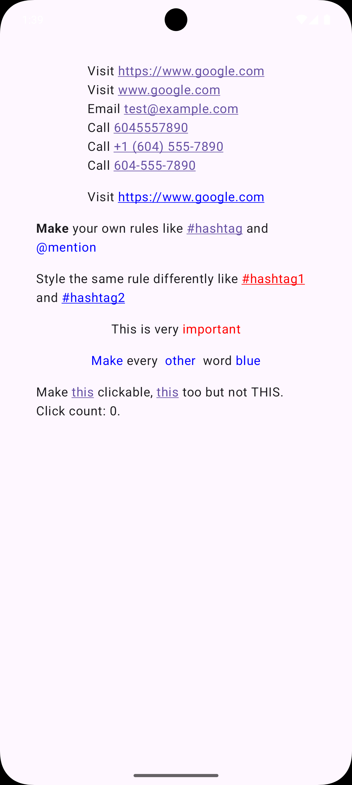
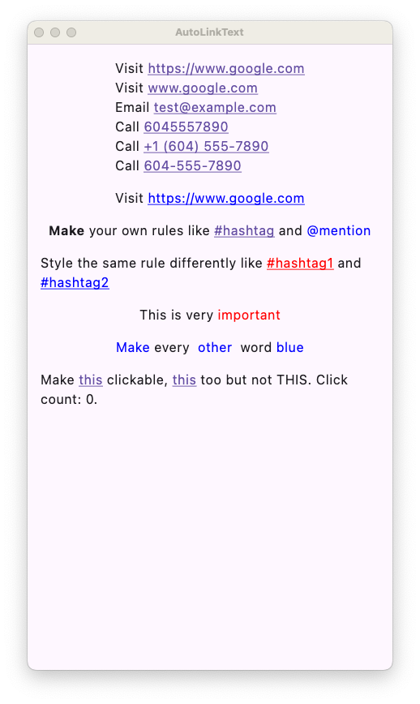

# AutoLinkText

AutoLinkText is a simple library that makes links, emails, and phone numbers clickable in text in Jetpack Compose and Kotlin Compose Multiplatform.

| Android                                                                                                                                                                                         | iOS                                                                                                                                                                                 |
| ----------------------------------------------------------------------------------------------------------------------------------------------------------------------------------------------- | ----------------------------------------------------------------------------------------------------------------------------------------------------------------------------------- |
| <picture><source media="(prefers-color-scheme: dark)" srcset="assets/android-dark.png"></picture> | <picture><source media="(prefers-color-scheme: dark)" srcset="assets/ios-dark.png"></picture> |

| Desktop                                                                                                                                                                                         | Web                                                                                                                                                                                 |
| ----------------------------------------------------------------------------------------------------------------------------------------------------------------------------------------------- | ----------------------------------------------------------------------------------------------------------------------------------------------------------------------------------- |
| <picture><source media="(prefers-color-scheme: dark)" srcset="assets/desktop-dark.png"></picture> | <picture><source media="(prefers-color-scheme: dark)" srcset="assets/web-dark.png"></picture> |

## Features

- Make links, emails, and phone numbers clickable in your text
- Create custom matchers for your own patterns (e.g. hashtags, mentions, etc.)
- Customizable styling for links
- Customizable click listeners for links
- Supports Compose Multiplatform (Android, iOS, Desktop/JVM, Wasm)

## Usage

### Version Catalog

If you're using Version Catalog, add the following to your `libs.versions.toml` file:

```toml
[versions]
#...
autolinktext = "1.0.0"

[libraries]
#...
autolinktext = { module = "sh.calvin.autolinktext:autolinktext", version.ref = "autolinktext" }
```

or

```toml
[libraries]
#...
autolinktext = { module = "sh.calvin.autolinktext:autolinktext", version = "1.0.0" }
```

### Gradle

If you're using Gradle instead add the following to your `build.gradle` file:

#### Kotlin DSL

```kotlin
dependencies {
    implementation("sh.calvin.autolinktext:autolinktext:1.0.0")
}
```

#### Groovy DSL

```groovy
dependencies {
    implementation 'sh.calvin.autolinktext:autolinktext:1.0.0'
}
```

### Caveats

- Google might be deprecating the `ClickableText` API in the future. (See [Google IssueTracker issue 323346994](https://issuetracker.google.com/issues/323346994)) I will try my best to keep this library up to date with the latest Compose APIs.
- Accessibility is not great if your onClick function does something other than opening a link. Hopefully this gets fixed in the future. (See [Google IssueTracker issue 274486643](https://issuetracker.google.com/issues/274486643))

### Examples

See [demo app code](demoApp/composeApp/src/commonMain/kotlin/sh/calvin/autolinktext/demo/App.kt) for more examples.

#### Basic Usage

By default `AutoLinkText` turns URLs, emails, and phone numbers into clickable links and underlines them.

```kotlin
AutoLinkText(
    text = """
        |Visit https://www.google.com
        |Visit www.google.com
        |Email test@example.com
        |Call 6045557890
        |Call +1 (604) 555-7890
        |Call 604-555-7890
    """.trimMargin(),
    style = LocalTextStyle.current.copy(
        color = LocalContentColor.current,
    ),
)
```

#### Customize Link Color

You can override the default styling by mapping over the default list of rules and changing the `style` in each default rule.

```kotlin
AutoLinkText(
    text = "...",
    style = LocalTextStyle.current.copy(
        color = LocalContentColor.current,
    ),
    textRules = TextRuleDefaults.defaultList().map {
        it.copy(
            style = SpanStyle(
                color = MaterialTheme.colorScheme.primary,
                textDecoration = TextDecoration.Underline
            )
        )
    }
)
```

#### Make Your Own Rules

Create your own rules by providing `TextRule`s with a `TextMatcher`, an optional `MatchStyle` for the matched text and an optional `onClick` lambda.

```kotlin
AutoLinkText(
    text = "Make your own rules like #hashtag and @mention",
    style = LocalTextStyle.current.copy(
        color = LocalContentColor.current,
    ),
    textRules = listOf(
        TextRule(
            textMatcher = TextMatcher.RegexMatcher(Regex("#\\w+")),
            style = SpanStyle(
                color = MaterialTheme.colorScheme.primary,
                textDecoration = TextDecoration.Underline
            ),
            onClick = {
                println("Hashtag ${it.matchedText} clicked")
            },
            annotationProvider = { "https://link.to.hashtag" },
        ),
        TextRule(
            textMatcher = TextMatcher.RegexMatcher(Regex("@\\w+")),
            style = SpanStyle(
                color = MaterialTheme.colorScheme.secondary,
                textDecoration = TextDecoration.Underline
            ),
            onClick = {
                println("Mention ${it.matchedText} clicked")
            },
            annotationProvider = { "https://link.to.mentions" },
        )
    )
)
```

#### Match Dependent Styling

Use `styleProvider` to provide a `SpanStyle` based on the matched text.

```kotlin
AutoLinkText(
    text = "Style the same rule differently like #hashtag1 and #hashtag2",
    style = LocalTextStyle.current.copy(
        color = LocalContentColor.current,
    ),
    textRules = listOf(
        TextRule(
            textMatcher = TextMatcher.RegexMatcher(Regex("#\\w+")),
            styleProvider = {
                val hashtag = it.matchedText
                if (hashtag == "#hashtag1") {
                    SpanStyle(
                        color = Color.Red,
                        textDecoration = TextDecoration.Underline
                    )
                } else {
                    SpanStyle(
                        color = Color.Blue,
                        textDecoration = TextDecoration.Underline
                    )
                }
            },
            onClick = {
                println("Hashtag ${it.matchedText} clicked")
            },
            annotationProvider = { "https://link.to.hashtag" },
        ),
    )
)
```

#### `TextRule`s don't have to be Clickable

You can create `TextRule`s that are not clickable by not providing an `onClick` lambda.

```kotlin
AutoLinkText(
    text = "This is very important",
    style = LocalTextStyle.current.copy(
        color = LocalContentColor.current,
    ),
    textRules = listOf(
        TextRule(
            textMatcher = TextMatcher.StringMatcher("important"),
            style = SpanStyle(color = Color.Red),
            annotationProvider = { null },
        ),
    )
)
```

#### Make Your Own Matcher

Create your own matchers with `TextMatcher.FunctionMatcher` that takes the given text and returns a list of `SimpleTextMatchResult`s.

```kotlin
AutoLinkText(
    text = "Make every  other  word blue",
    style = LocalTextStyle.current.copy(
        color = LocalContentColor.current,
    ),
    textRules = listOf(
        TextRule(
            textMatcher = TextMatcher.FunctionMatcher {
                val matches = mutableListOf<SimpleTextMatchResult<Nothing?>>()
                var currentWordStart = 0
                "$it ".forEachIndexed { index, char ->
                    if (char.isWhitespace()) {
                        val match = SimpleTextMatchResult(
                            start = currentWordStart,
                            end = index,
                        )
                        if (it.slice(match).isNotBlank()) {
                            matches.add(match)
                        }
                        currentWordStart = index + 1
                    }
                }
                matches.filterIndexed { index, _ ->  index % 2 == 0 }
            },
            style = SpanStyle(color = Color.Blue),
            annotationProvider = { null },
        ),
    )
)
```

## API

- [AutoLinkText](autolinktext/src/commonMain/kotlin/sh/calvin/autolinktext/AutoLinkText.kt)
- [TextRule](autolinktext/src/commonMain/kotlin/sh/calvin/autolinktext/TextRule.kt)
- [TextRuleDefaults](autolinktext/src/commonMain/kotlin/sh/calvin/autolinktext/TextRule.kt)
  - [webUrl](autolinktext/src/commonMain/kotlin/sh/calvin/autolinktext/TextRule.kt)
  - [emailAddress](autolinktext/src/commonMain/kotlin/sh/calvin/autolinktext/TextRule.kt)
  - [phoneNumber](autolinktext/src/commonMain/kotlin/sh/calvin/autolinktext/TextRule.kt)
  - [defaultList](autolinktext/src/commonMain/kotlin/sh/calvin/autolinktext/TextRule.kt)
- [TextMatcher](autolinktext/src/commonMain/kotlin/sh/calvin/autolinktext/TextMatcher.kt)
  - [RegexMatcher](autolinktext/src/commonMain/kotlin/sh/calvin/autolinktext/TextMatcher.kt)
  - [StringMatcher](autolinktext/src/commonMain/kotlin/sh/calvin/autolinktext/TextMatcher.kt)
  - [FunctionMatcher](autolinktext/src/commonMain/kotlin/sh/calvin/autolinktext/TextMatcher.kt)
- [TextMatcherDefaults](autolinktext/src/commonMain/kotlin/sh/calvin/autolinktext/TextMatcher.kt)
  - [webUrl](autolinktext/src/commonMain/kotlin/sh/calvin/autolinktext/TextMatcher.kt)
  - [emailAddress](autolinktext/src/commonMain/kotlin/sh/calvin/autolinktext/TextMatcher.kt)
  - [phoneNumber](autolinktext/src/commonMain/kotlin/sh/calvin/autolinktext/TextMatcher.kt)
- [MatchFilter](autolinktext/src/commonMain/kotlin/sh/calvin/autolinktext/MatchFilter.kt)
- [MatchFilterDefaults](autolinktext/src/commonMain/kotlin/sh/calvin/autolinktext/MatchFilter.kt)
  - [NoOp](autolinktext/src/commonMain/kotlin/sh/calvin/autolinktext/MatchFilter.kt)
  - [WebUrls](autolinktext/src/commonMain/kotlin/sh/calvin/autolinktext/MatchFilter.kt)
  - [PhoneNumber](autolinktext/src/commonMain/kotlin/sh/calvin/autolinktext/MatchFilter.kt)
- [MatchStyleProvider](autolinktext/src/commonMain/kotlin/sh/calvin/autolinktext/MatchStyleProvider.kt)
- [SimpleTextMatchResult](autolinktext/src/commonMain/kotlin/sh/calvin/autolinktext/SimpleTextMatchResult.kt)
- [TextMatchResult](autolinktext/src/commonMain/kotlin/sh/calvin/autolinktext/TextMatchResult.kt)
- [MatchClickHandlerDefaults](autolinktext/src/commonMain/kotlin/sh/calvin/autolinktext/MatchClickHandler.kt)
  - [webUrl](autolinktext/src/commonMain/kotlin/sh/calvin/autolinktext/MatchClickHandler.kt)
  - [emailAddress](autolinktext/src/commonMain/kotlin/sh/calvin/autolinktext/MatchClickHandler.kt)
  - [phoneNumber](autolinktext/src/commonMain/kotlin/sh/calvin/autolinktext/MatchClickHandler.kt)

## Running the demo app

To run the Android demo app, open the project in Android Studio and run the app.

To run the iOS demo app, open the iosApp project in Xcode and run the app or add the following Configuration to the Android Studio project, you may need to install the [Kotlin Multiplatform Mobile plugin](https://plugins.jetbrains.com/plugin/14936-kotlin-multiplatform-mobile) first.


To run the web demo app, run `./gradlew :composeApp:wasmJsBrowserDevelopmentRun`.

To run the desktop demo app, run `./gradlew :demoApp:ComposeApp:run`.

## Contributing

Open this project with Android Studio Preview.

You'll want to install the [Kotlin Multiplatform Mobile plugin](https://plugins.jetbrains.com/plugin/14936-kotlin-multiplatform-mobile) in Android Studio before you open this project.

## License

```
Copyright 2023 Calvin Liang

Licensed under the Apache License, Version 2.0 (the "License");
you may not use this file except in compliance with the License.
You may obtain a copy of the License at

     http://www.apache.org/licenses/LICENSE-2.0

Unless required by applicable law or agreed to in writing, software
distributed under the License is distributed on an "AS IS" BASIS,
WITHOUT WARRANTIES OR CONDITIONS OF ANY KIND, either express or implied.
See the License for the specific language governing permissions and
limitations under the License.
```
